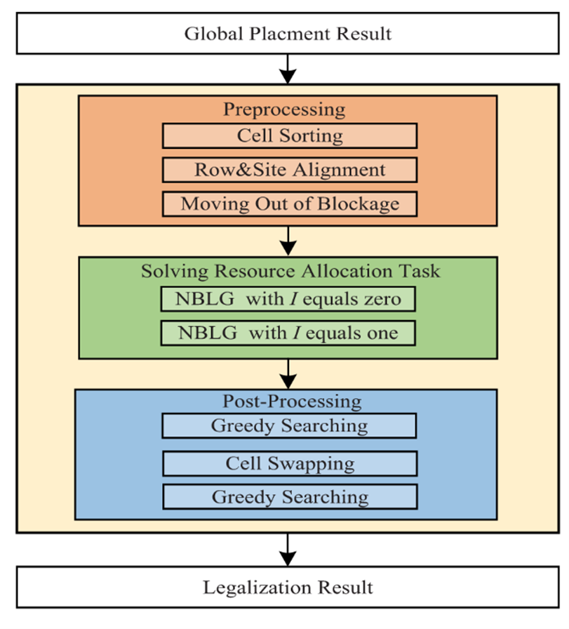

# Mixed-Cell-Height Legalizer(MCHLG)

MCHLG is a negotiation-based legalizer (NBLG) designed to address the challenges posed by mixed-cell-height circuits in modern design. As designs become increasingly complex, mixed-cell-height designs have gained popularity, making the legalization problem more challenging. MCHLG aims to reduce average displacement and maximum displacement while considering fence regions and technology constraints.

The contributions are summarized as follows. 
1) The algorithm innovatively transforms the layout legalization problem into a grid resource allocation problem, mapping the grid points corresponding to standard cells to the costs generated in the negotiation process. Cells compete for grid resources, effectively solving large-scale resource allocation problems and achieving high-quality legalization.

2) The algorithm employs isolation points and adaptive penalty functions during the legalization process to accelerate the algorithm and reduce displacements. It limits the searchable space of each cell to the surrounding window to avoid local optima.

3) The algorithm utilizes multithreading techniques to achieve load balancing, accelerate the convergence of the negotiation method, and improve the efficiency and speed of the legalization process.


The algorithm's flow consists of three main parts: **Preprocessing**, **Solving the resource allocation task**, and **Post-optimization**, as shown in the figure below.

<p align="center">
  
</p>

- **Preprocessing**:
  - The cells are first sorted.
  - Row alignment is performed.
  - The cells are then moved out of illegal regions.

- **Solving the resource allocation task**:
  - All cells compete for grid resources to eliminate overlaps.
  - The algorithm accelerates the convergence process and reduces cell displacements through two techniques: isolation points and adaptive penalty functions.
  - Each cell's searchable space is constrained within the surrounding window, rather than a fixed space, to ensure that cell movements can gradually accumulate to move out of the local window.

- **Post-optimization**:
  - A greedy method and bipartite matching algorithm are employed to further reduce cell displacements, enhancing the quality of the legalization solution.

More details are in the following paper:
- J. Chen, Z. Di, J. Shi, Q. Feng and Q. Wu, "NBLG: A Robust Legalizer for Mixed-Cell-Height Modern Design," in IEEE Transactions on Computer-Aided Design of Integrated Circuits and Systems, vol. 41, no. 11, pp. 4681-4693, Nov. 2022, doi: 10.1109/TCAD.2021.3137007.

## Installation
MCHLG uses CMake for its build system. Ensure you have CMake and a compatible C++ compiler installed ((e.g., GCC 9.4.0 or GCC 7.5.0)). 
```bash
-- The C compiler identification is GNU 9.4.0
-- The CXX compiler identification is GNU 9.4.0
-- Check for working C compiler: /usr/bin/gcc-9
-- Check for working C compiler: /usr/bin/gcc-9 -- works
```
To install MCHLG, follow these steps:
1. Clone the repository:
```bash
git clone https://github.com/recurme/Mixed-Cell-Height_legalizer.git
```
2. Navigate to the project directory:
```bash
cd Mixed-Cell-Height_legalizer
```
3. Run the build script:
``` bash
./build.sh
``` 

## Usage

To use MCHLG, follow these steps:
1. Navigate to the project directory:
···bash
cd Mixed-Cell-Height-Legalizer
tar -xzvf ./benchmarks/benchmarks.tar.gz
···
2. Run the provided script for 2017 benchmarks version:
```bash
./run.sh
./run_all.sh
```
## Project Directory Structure
```bash
Mixed-Cell-Height_legalizer/
├── build.sh*                  # Installation
├── CMakeLists.txt
├── include/                   # include head file
├── Readme.md
├── run.sh*                    # run a case
├── run_all.sh*                # run all cases
├── src/
│   ├── main.cpp               # main function
│   ├── matrix.cpp             
│   ├── multi_Imp.cpp          # Multithreading Implementation
│   ├── munkres.cpp            # Bipartite graph matching algorithm
│   ├── nall.cpp               # The main framework of the algorithm
│   ├── parser.cpp             # LEF/DEF file parser
│   ├── parser_helper.cpp      
│   ├── post.cpp               # Postoptimization
│   ├── pre.cpp                # Preprocessing
│   ├── ripup.cpp              # Negotiation Action: ripup
│   ├── rtree.cpp              # rtree Detecting Rectangle Conflicts
│   └── utils.cpp
└── utils/
```

## License

READ THIS LICENSE AGREEMENT CAREFULLY BEFORE USING THIS PRODUCT. BY USING THIS PRODUCT YOU INDICATE YOUR ACCEPTANCE OF THE TERMS OF THE FOLLOWING AGREEMENT. THESE TERMS APPLY TO YOU AND ANY SUBSEQUENT LICENSEE OF THIS PRODUCT.

License Agreement for Mixed-Cell-Height Legalizer

Copyright (c) 2024, Southwest Jiaotong University All rights reserved.

CU-SD LICENSE (adapted from the original BSD license) Redistribution of the any code, with or without modification, are permitted provided that the conditions below are met.

1. Redistributions of source code must retain the above copyright notice, this list of conditions and the following disclaimer.
    
2. Redistributions in binary form must reproduce the above copyright notice, this list of conditions and the following disclaimer in the documentation and/or other materials provided with the distribution.
    
3. Neither the name nor trademark of the copyright holder or the author may be used to endorse or promote products derived from this software without specific prior written permission.
    
4. Users are entirely responsible, to the exclusion of the author, for compliance with (a) regulations set by owners or administrators of employed equipment, (b) licensing terms of any other software, and (c) local, national, and international regulations regarding use, including those regarding import, export, and use of encryption software.
    

THIS FREE SOFTWARE IS PROVIDED BY THE AUTHOR "AS IS" AND ANY EXPRESS OR IMPLIED WARRANTIES, INCLUDING, BUT NOT LIMITED TO, THE IMPLIED WARRANTIES OF MERCHANTABILITY AND FITNESS FOR A PARTICULAR PURPOSE ARE DISCLAIMED. IN NO EVENT SHALL THE AUTHOR OR ANY CONTRIBUTOR BE LIABLE FOR ANY DIRECT, INDIRECT, INCIDENTAL, SPECIAL, EXEMPLARY, OR CONSEQUENTIAL DAMAGES (INCLUDING, BUT NOT LIMITED TO, EFFECTS OF UNAUTHORIZED OR MALICIOUS NETWORK ACCESS; PROCUREMENT OF SUBSTITUTE GOODS OR SERVICES; LOSS OF USE, DATA, OR PROFITS; OR BUSINESS INTERRUPTION) HOWEVER CAUSED AND ON ANY THEORY OF LIABILITY, WHETHER IN CONTRACT, STRICT LIABILITY, OR TORT (INCLUDING NEGLIGENCE OR OTHERWISE) ARISING IN ANY WAY OUT OF THE USE OF THIS SOFTWARE, EVEN IF ADVISED OF THE POSSIBILITY OF SUCH DAMAGE.

---

For any inquiries, contact [zxdi@home.swjtu.edu.cn].

---

### Index Terms

Pins;Task analysis;Rails;Standards;Routing;Metals;Resource management;Electronic design automation;legalization;physical design;placement;